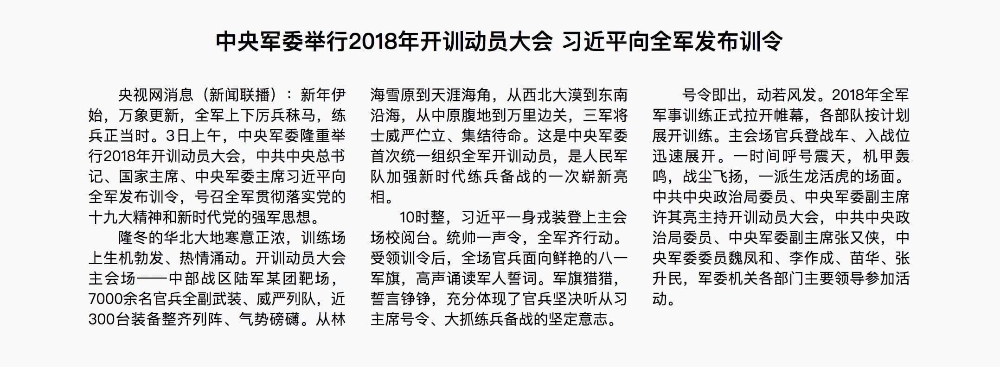

## 分栏布局

分栏布局可以实现大段文字像报纸排版一样分栏显示，部分属性如下：

```css
/*栏目宽度*/
column-width: 100px;

/*栏目间距*/
column-gap: 10px;

/*栏目列数*/
column-count: 3;

/*栏目间隔线*/
column-rule: 1px solid #ddd;
```

示例和效果如下：

```html
<style>
    div { 
        column-count: 3; 
        column-gap: 26px; 
        text-align: justify; 
        text-indent: 2em;
    }
</style>
<div>
    <!-- 一大段文字 -->
</div>
```



## 网格布局

### 作用在网格容器上的属性 


```css
.container {
    display: grid;
    grid-template-columns: 100px auto 100px;   /*三列 宽度1和3列100px，中间自适应*/
    grid-template-columns: 1rf 3rf 1rf 1rf:    /*四列 宽度比例为1:3:1:1*/
    grid-template-columns: repeat(3, 200px);   /*三列 宽度都为200px*/
    grid-template-rows: 300px 200px 200px;     /*行数 和columns类似*/
    
    grid-column-gap: 5px;                      /*列间距5px*/
    gird-gap: 5px;                             /*行列间距5px*/
    
    /*网格在水平方向的对齐方式，作用所有网格*/
    justify-items: start | end | center | stretch（默认）
    
    /*网格在竖直方向的对齐方式，作用所用网格*/
    align-items: start | end | center | stretch
    
    /*网格区域宽度可能小于网格容器，设置网格区域在容器内水平方向的对齐方式*/
    justify-content: start | end | center | stretch | space-around | space-between | space-evenly
    
    /*网格区域高度可能小于网格容器，设置网格区域在容器内垂直方向的对齐方式*/
    align-content: start | end | center | stretch | space-around | space-between | space-evenly
    
    grid-auto-columns: 10px;    /*隐式网格宽度 网格区域大于容器，自动创建隐式网格*/
    grid-auto-rows: 10px;       /*隐式网格高度 网格区域大于容器，自动创建隐式网格*/
    
    /*没有指定网格位置时，控制网格排列，默认从左到右排*/
    grid-auto-flow : row（默认） | column | dense
    
    /*缩写，none表示全部默认*/
    grid: none | <grid-template-rows> / <grid-template-columns> | <grid-auto-flow> [<grid-auto-rows> [ / <grid-auto-columns>] ];
}

```

### 网格项属性

#### 1, grid-column grid-row

```
grid-column-start: <number> | <name> | span <number> | span <name> | auto ;    
grid-column-end: <number> | <name> | span <number> | span <name> | auto ;    
grid-row-start: <number> | <name> | span <number> | span <name> | auto ;    
grid-row-end: <number> | <name> | span <number> | span <name> | auto ;  
```  

> \<number> | \<name>: 指定带编号或者名字的网格线。    
> span \<number\>: 跨越轨道的数量。    
span \<name>: 跨越轨道直到对应名字的网格线。    
auto: 自动展示位置，默认跨度为1。 

```
/*缩写形式*/
grid-column: <start-line> / <end-line> | <start-line> / span <value>
grid-row: <start-line> / <end-line> | <start-line> / span <value>
```   

#### 2, grid-area

定义网格项名字，或设置网格项的位置

```
grid-area: <name> | <row-start> / <column-start> / <row-end> / <column-end>
```

> name: 网格项名字。
\<row-start> / \<column-start> / \<row-end> / \<column-end>: 可以是数字或网格线名字

例如：

```css
.item-a{
  grid-area: 1 / col4-start / last-line / 6 ;
}
```

#### 3, justify-self

网格项在水平方向上的对齐方式

```css
justify-self: start（默认） | end | center | stretch
```

#### 4, align-self

网格项在垂直方向上的对齐方式

```css
align-self: start（默认） | end | center | stretch
```

### 参考

1. [网格布局的基本概念](https://developer.mozilla.org/zh-CN/docs/Web/CSS/CSS_Grid_Layout/Basic_Concepts_of_Grid_Layout)
2. [Grid布局指南-简书](https://www.jianshu.com/p/d183265a8dad)


